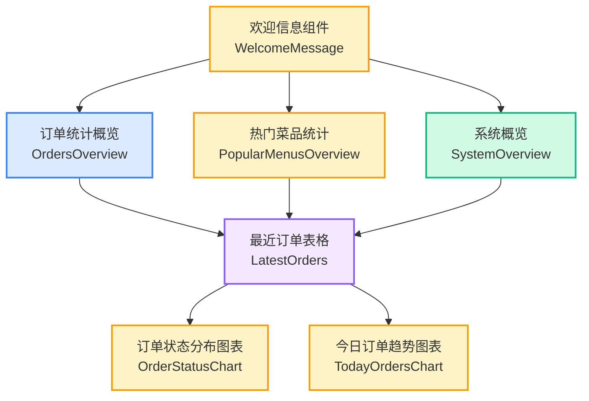
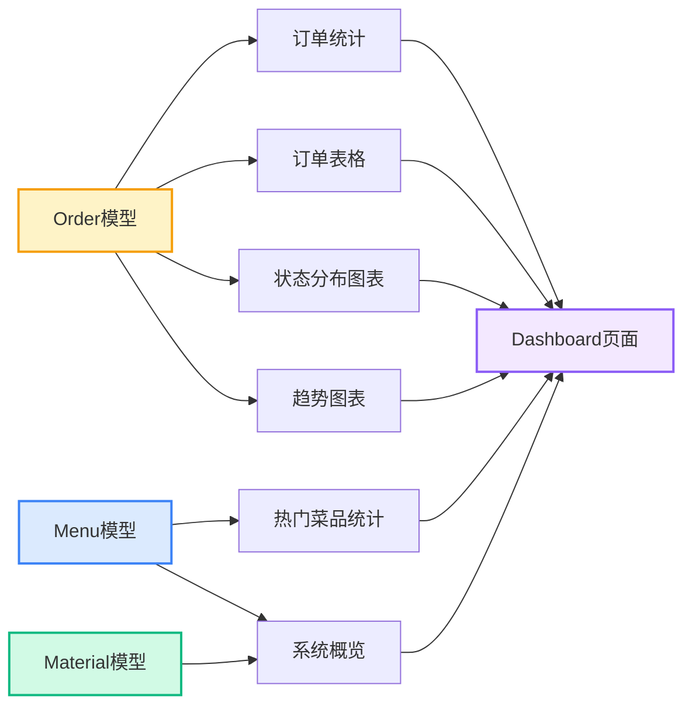
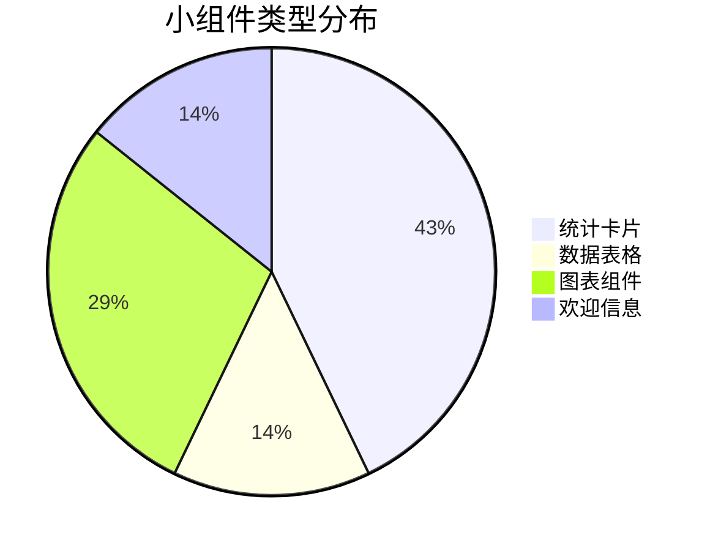
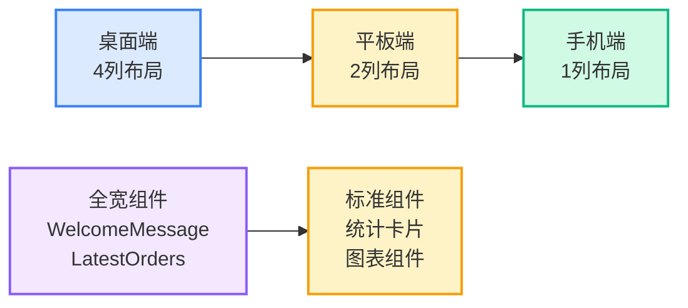

# Dashboard 布局结构图

## 小组件布局示意图

## 数据流向图

## 组件类型分类

## 响应式布局说明

## 功能特性

- ✅ **实时数据更新**: 所有小组件都会实时反映数据库变化
- ✅ **响应式设计**: 适配不同屏幕尺寸
- ✅ **个性化欢迎**: 根据时间显示不同问候语
- ✅ **数据可视化**: 使用图表直观显示数据分布
- ✅ **状态管理**: 订单状态用颜色区分
- ✅ **空数据处理**: 优雅处理无数据情况
- ✅ **性能优化**: 使用数据库查询优化
